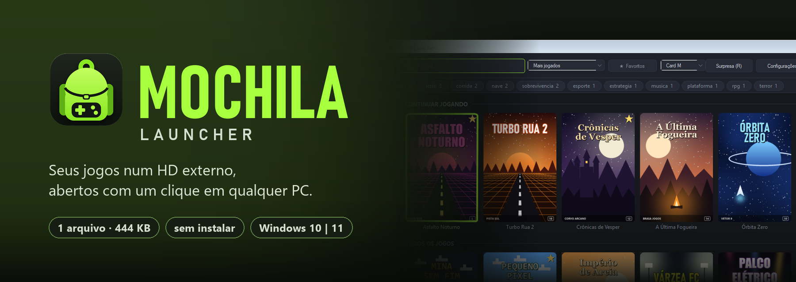
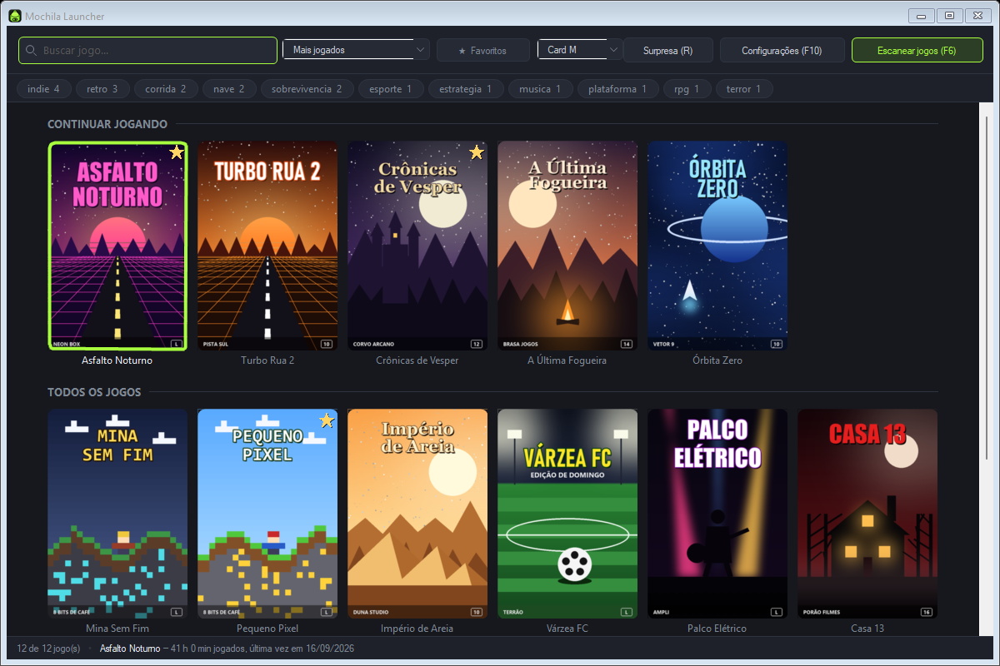
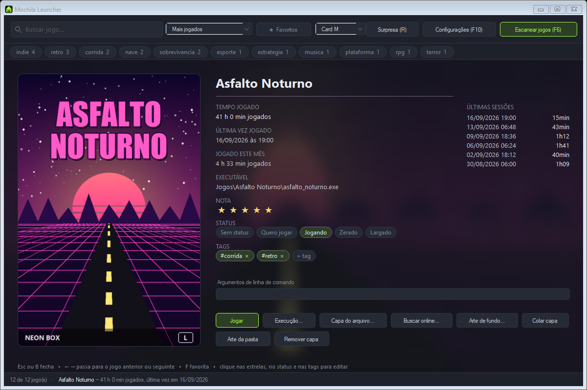

<div align="center">



<br>

Um launcher de jogos que mora no HD junto com os jogos: mostra tudo numa grade de capas,<br>
descobre sozinho qual arquivo abre cada jogo e funciona em qualquer PC com Windows, sem instalar nada.

<br>

[](../../releases/latest)
&nbsp;
[](#manual-completo)


**[O que é](#o-que-é)** · **[Como usar](#como-usar-em-4-passos)** · **[Perguntas frequentes](#perguntas-frequentes)** · **[Visão técnica](#visão-técnica)** · **[Manual](#manual-completo)**

</div>

<br>

## O que é

Quem guarda jogos num HD externo conhece a rotina: abrir a pasta, procurar no meio de
`Uninstall.exe`, `Setup.exe` e três arquivos parecidos qual é o que abre o jogo, e repetir
tudo no notebook do amigo, onde o HD aparece com outra letra e nada funciona.

O **Mochila** resolve isso. Você copia um único arquivo para o HD, aponta a pasta dos jogos
e pronto: vira uma biblioteca com capas, busca, favoritos e tempo jogado, que vai junto com
o HD para qualquer PC.

<p align="center">
  
  <br>
  <sub>Jogos, estúdios e capas dos prints são fictícios, criados só para a demonstração.</sub>
</p>

| Recurso | O que significa para você |
|---|---|
| 🎒 **Portátil de verdade** | Nada é instalado e nada fica no PC. Tudo mora no HD, e funciona mesmo quando o HD muda de letra (`E:` aqui, `F:` ali). |
| 🔎 **Acha o jogo sozinho** | Varre as pastas e escolhe o executável certo, ignorando instaladores e ferramentas. Você só confirma. |
| 🖼️ **Capas automáticas** | Baixa capas e artes de fundo do SteamGridDB, com uma chave gratuita. Sem internet, usa arte da pasta ou o ícone do jogo. |
| 🪶 **Feito para PC fraco** | Um `.exe` de 477 KB. Com o jogo aberto, o launcher fica escondido usando **0% de CPU** e cerca de **4 MB** de memória. |
| 🎮 **Controle de Xbox** | Navega, abre jogos e marca favoritos pelo controle, sem configurar nada. |
| 📊 **Seu histórico** | Tempo jogado, últimas sessões, "continuar jogando", notas, status (zerado, jogando…) e estatísticas por mês. |

<p align="center">
  
</p>

---

## Como usar em 4 passos

1. **Baixe** o `Mochila.exe` na página de [Releases](../../releases/latest).
2. **Copie** para uma pasta dentro do HD, por exemplo `D:\Mochila\`, ao lado da pasta dos
   seus jogos.
3. **Abra** e aperte **F6**. Escolha a pasta dos jogos, confira a lista que ele montou e
   clique em **Adicionar**.
4. *(Opcional)* **Capas automáticas:** aperte **F10** e cole sua chave do SteamGridDB
   ([como conseguir, abaixo](#capas-automáticas-chave-do-steamgriddb)).

Requisito: **Windows 10 ou 11**. Não precisa instalar mais nada.

> [!NOTE]
> **Na primeira vez, o Windows pode mostrar "O Windows protegeu o computador".** Isso
> acontece com todo programa sem assinatura digital paga, não por ele ser perigoso. Clique
> em **Mais informações → Executar assim mesmo**. Quer conferir se o arquivo é o original?
> Compare o SHA-256 publicado na página do release.

### Como fica o HD

```
D:\
├── Mochila\
│   ├── Mochila.exe
│   └── _mochila\        ← criada sozinha: biblioteca, capas, histórico e configurações
└── Jogos\
    ├── Asfalto Noturno\
    └── Crônicas de Vesper\
```

Para abrir o launcher direto da raiz do HD, crie um arquivo `D:\Jogar.bat` com a linha
abaixo. Diferente de um atalho comum, ele continua funcionando quando a letra do HD muda.

```bat
@start "" "%~dp0Mochila\Mochila.exe"
```

### Capas automáticas: chave do SteamGridDB

O [SteamGridDB](https://www.steamgriddb.com) é um acervo gratuito de capas de jogos mantido
pela comunidade. Para o Mochila baixar capas de lá, você precisa de uma chave pessoal, que
também é grátis:

1. Entre em [steamgriddb.com/login](https://www.steamgriddb.com/login) com sua conta Steam.
2. Abra [Preferences → API](https://www.steamgriddb.com/profile/preferences/api) e clique em
   **Generate API Key**.
3. Copie a chave, abra o Mochila, aperte **F10**, cole em **Chave do SteamGridDB** e clique
   em **Salvar**.

Depois, clique com o botão direito em qualquer card → **Baixar capas que faltam...**

O F10 tem esse mesmo passo a passo no link **Como conseguir uma chave (é grátis)**. A chave
fica só no seu HD; não compartilhe a pasta `_mochila`.

---

## Perguntas frequentes

<details>
<summary><b>É seguro? O que ele faz no meu PC?</b></summary>

<br>

Ele não instala nada, não cria serviço em segundo plano e não grava nada fora da própria
pasta. As exceções são duas, e só acontecem se você pedir: o atalho na área de trabalho, e
o [runtime DirectX portátil](#o-jogo-reclama-de-d3dx9_xxdll-ou-xinput1_3dll), que grava
chaves **temporárias** no registro do seu usuário enquanto um jogo antigo está aberto e
apaga quando ele fecha. Sem a chave do SteamGridDB e sem pedir o runtime DirectX, ele não
faz **nenhuma** conexão com a internet. O código inteiro está aqui, aberto.
</details>

<details>
<summary><b>Ele baixa ou vem com jogos?</b></summary>

<br>

Não. O Mochila só organiza e abre jogos que **já estão** no seu HD.
</details>

<details>
<summary><b>Funciona com jogos da Steam, Epic, EA…?</b></summary>

<br>

Não é para isso. Jogos dessas lojas dependem da loja instalada e logada no PC, então não
rodam direto de um HD externo. O Mochila ignora essas pastas de propósito. Ele é feito para
jogos que abrem sozinhos: jogos antigos, indies, versões portáteis.
</details>

<details>
<summary><b>Se eu apagar um jogo da biblioteca, apaga o jogo?</b></summary>

<br>

Não. Some só o card, a capa e o tempo jogado. Os arquivos do jogo continuam intactos, e um
**F6** traz ele de volta.
</details>

<details>
<summary><b>Mudei as pastas de lugar. Perco o tempo jogado?</b></summary>

<br>

Não. Cada jogo guarda uma "impressão digital" do executável. Aperte **F6** e o Mochila
reconhece o mesmo jogo no lugar novo, mantendo capa, tempo e favorito.
</details>

<details>
<summary><b>Meus saves vão junto com o HD?</b></summary>

<br>

Depende do jogo. Jogos antigos costumam salvar dentro da própria pasta, e aí o progresso já
viaja com o HD. Os mais novos salvam no perfil do Windows, que fica no PC. Para esses, dois
scripts pequenos que o Mochila roda antes e depois do jogo levam o save junto. O
[guia de saves portáteis](docs/saves-portateis/) explica o passo a passo, tem os modelos
prontos e um [prompt para a sua IA](docs/saves-portateis/prompt-para-ia.md) montar os
scripts por você.
</details>

<details>
<summary><b>Meu controle de PlayStation não funciona.</b></summary>

<br>

O Mochila entende controles no padrão do Xbox (XInput). Controles de PlayStation usam outro
padrão; use o DS4Windows ou o Steam Input para traduzir.
</details>

<details>
<summary><b>O jogo reclama de <code>d3dx9_XX.dll</code> ou <code>xinput1_3.dll</code>.</b></summary>

<a id="o-jogo-reclama-de-d3dx9_xxdll-ou-xinput1_3dll"></a>

<br>

É o DirectX 9 antigo. O Windows 10 e 11 já trazem o Direct3D 9, mas não as bibliotecas
auxiliares (D3DX9, XInput 1.3, XAudio2, XACT) que o instalador do DirectX de 2010
colocava no sistema. Normalmente, você teria que instalar isso em cada PC, e com admin.

O Mochila resolve uma vez só: aperte **F10** e, em **Runtime DirectX para jogos antigos**,
clique em **Baixar da Microsoft...**. Ele baixa o pacote oficial direto do site da Microsoft
(uns 96 MB), confere a assinatura e guarda as bibliotecas em `_mochila\runtime\directx`
(uns 225 MB). Daí em diante, todo jogo aberto pelo Mochila acha essas DLLs em qualquer PC,
**sem instalar nada e sem pedir administrador**. Num PC que já tem o DirectX, o Windows
continua usando o dele.

As DLLs não vêm junto com o Mochila porque a licença da Microsoft não permite
redistribuí-las soltas. Pelo mesmo motivo, não passe a sua pasta `runtime` para outras
pessoas: cada Mochila baixa o próprio pacote.

O runtime não resolve jogos com DRM de CD (SafeDisc, SecuROM, StarForce), multiplayer por
DirectPlay nem programas de 16 bits: esses dependem de recursos que o Windows só instala
com admin, ou que não existem mais.
</details>

<details>
<summary><b>O jogo não abre.</b></summary>

<br>

Quase sempre é o executável errado. Aperte **F6** e, na lista, escolha o arquivo certo na
coluna do meio. Marque **Não alterar em rescan** para a escolha ficar salva.
</details>

---

## Visão técnica

> Para recrutadores e desenvolvedores: o que foi construído, as decisões por trás e como o
> projeto é verificado.

### Em números

| Aspecto | Detalhe |
|---|---|
| **Linguagem e stack** | C# · WinForms · .NET Framework 4.8 |
| **Tamanho do código** | ~20 mil linhas de produção + ~10 mil linhas de testes |
| **Testes automatizados** | 1170, embutidos na build de desenvolvimento (`--autoteste`) |
| **Dependências em runtime** | Nenhuma. Sem NuGet no binário, sem banco de dados, sem navegador embutido |
| **Binário final** | 1 arquivo, 477 KB, com o ícone embutido como recurso |
| **Uso com jogo aberto** | 0 ms de CPU e ~4 MB de RAM, medidos por benchmark próprio |

### Decisões de engenharia

- **Portabilidade como regra de arquitetura.** Todo caminho é gravado relativo à pasta do
  executável, e um único ponto do código (`Dados/Caminhos.cs`) decide onde as coisas moram.
  O alvo é .NET Framework 4.8 **de propósito**: ele já vem em todo Windows 10 e 11, então o
  exe roda em qualquer PC sem instalar runtime. Migrar para .NET 8 acabaria com isso.
- **Scanner com pontuação.** Cada executável candidato recebe pontos por nome, tamanho,
  pasta onde está, semelhança com o nome do jogo e subsistema lido direto do
  cabeçalho PE (`Scanner/LeitorPe.cs`). Instaladores e redistribuíveis são vetados. Palpites
  de baixa confiança aparecem destacados para revisão, e nada é gravado sem confirmação.
- **Identidade do jogo que sobrevive a mudanças.** Uma impressão digital (nome, tamanho e
  hash dos primeiros 64 KB do exe) religa o jogo depois de a pasta ser movida ou renomeada,
  mantendo histórico e capa. Quando há ambiguidade, o usuário decide; nunca religa sozinho.
- **DirectX 9 sem instalar e sem admin.** O pacote oficial da Microsoft é baixado sob
  pedido, conferido (SHA-256 ou assinatura Authenticode) e aberto com o `expand.exe` do
  Windows. No lançamento, a pasta da arquitetura do jogo (lida do cabeçalho PE) entra no
  PATH que o jogo herda, e XACT/XAudio2 ≤ 2.7, que são objetos COM, são registrados em
  `HKCU\Software\Classes` só se o PC não os tiver, e apagados quando o jogo fecha
  (`Execucao/RuntimeDirectX.cs`).
- **Jogos com launcher próprio.** Quando o exe aberto termina em segundos e passa o
  controle a outro processo, o Mochila localiza esse processo dentro da pasta do jogo e se
  prende a ele, em vez de reaparecer por cima do jogo em tela cheia.
- **Dados que não se perdem.** Gravação atômica dos arquivos JSON, schema versionado com
  migração, e um modo **somente leitura** quando o arquivo foi gravado por uma versão mais
  nova, para não apagar campos que este binário não conhece. Arquivo corrompido é guardado
  com data, nunca sobrescrito.
- **Grade leve.** Grade de capas desenhada à mão (`OwnerDraw`), com miniaturas em cache em
  disco e carregamento fora da thread de interface. Um benchmark de memória
  (`--bench-memoria`) acompanha RAM e handles a cada mudança.
- **Segredo tratado como segredo.** A chave da API viaja só no cabeçalho `Authorization`.
  Testes verificam que ela não aparece em URL, log, mensagem de erro, nem em pedaço.
- **Acessibilidade de cor verificada.** As duas paletas (escura e clara) passam por testes
  de contraste com a régua da WCAG.

### Como a qualidade é garantida

- **Testes sem dependência externa.** Disco e rede passam por interfaces
  (`ISistemaDeArquivos`, cliente HTTP simulado), o que permite testar scanner, capas e
  falhas de rede sem tocar em arquivos reais nem na internet.
- **Testes de layout por imagem.** As telas se desenham num PNG fora da área visível
  (`--captura`), sem roubar o foco. Um bug que escondia metade da tela de configurações só
  apareceu assim, e virou teste de geometria.
- **Benchmarks versionados** de memória, abertura de detalhes e lançamento de jogo.
- **Build de produção limpa.** Testes, benchmarks e dados de demonstração existem só em
  `#if DEBUG`; o exe entregue não leva nada disso.

### Estrutura do código

```
src/
├── Program.cs              entrada, modos de diagnóstico e captura
├── FormPrincipal.cs        janela principal
├── Scanner/                varredura de pastas, pontuação, leitura de PE, impressão digital
├── Modelo/                 biblioteca, jogo, configurações, sessões, busca e filtros
├── Execucao/               abrir jogo, adotar processo-filho, contar tempo, scripts
├── Capas/                  SteamGridDB, arte local e extração de ícone
├── Entrada/                controle XInput e roteamento de comandos
├── Dados/                  caminhos portáteis, JSON e gravação atômica
├── UI/                     grade, detalhes, telas de configuração, tema e ícone
├── Util/                   textos, tempo e memória
└── Diagnostico/            suíte de testes, benchmarks e acervo de demonstração (só Debug)
```

### Compilar e testar

```powershell
dotnet build                                  # Debug: inclui testes e benchmarks
dotnet build -c Release                       # o exe que vai para o HD

bin\Debug\Mochila.exe --autoteste             # roda os 1170 testes
bin\Debug\Mochila.exe --grade-demo 60         # abre com um acervo de demonstração
```

<details>
<summary><b>Todos os comandos de diagnóstico</b></summary>

<br>

```powershell
bin\Debug\Mochila.exe --bench-memoria 200 --ciclos 10   # RAM e handles da grade
bin\Debug\Mochila.exe --bench-detalhes 50               # RAM da tela de detalhes
bin\Debug\Mochila.exe --bench-detalhes 50 --com-hero    # idem, com arte de fundo e logo
bin\Debug\Mochila.exe --bench-lancamento --ciclos 4     # RAM com jogo aberto
bin\Debug\Mochila.exe --grade-demo 40 --com-historico   # demonstração com sessões inventadas
bin\Debug\Mochila.exe --escanear ..\Jogos               # scan sem gravar nada
bin\Debug\Mochila.exe --gerar-icone mochila.ico         # regera o ícone do exe
bin\Debug\Mochila.exe --preparar-runtime-dx C:\teste    # baixa o runtime DirectX numa pasta de teste
```

Capturas de tela, desenhadas fora da área visível:

```powershell
bin\Debug\Mochila.exe --grade-demo 40 --captura grade.png
bin\Debug\Mochila.exe --grade-demo 40 --captura detalhes.png --detalhes
bin\Debug\Mochila.exe --grade-demo 40 --captura hero.png --detalhes --com-hero
bin\Debug\Mochila.exe --grade-demo 40 --captura lote.png --marcados
bin\Debug\Mochila.exe --grade-demo 40 --com-historico --captura estat.png --estatisticas
bin\Debug\Mochila.exe --grade-demo 40 --captura config.png --configuracoes
bin\Debug\Mochila.exe --grade-demo 40 --tema claro --captura claro.png
bin\Debug\Mochila.exe --grade-demo 20 --captura estreita.png --tamanho 700 460
```

**Ícone.** A arte sai de código, em `assets\gerar-icone.py` (Pillow e numpy, a única parte
do projeto que não é C#). Ela grava `assets\mochila-fonte.png` (1024 px),
`assets\mochila.png` (256 px, embutido no exe) e `assets\github-preview.png`. Para mudar o
ícone:

```powershell
python assets\gerar-icone.py
dotnet build -c Debug
bin\Debug\Mochila.exe --gerar-icone mochila.ico
dotnet build -c Release
```

`--escanear` fica também na build Release, por ser código de produção útil para investigar
um scan estranho.
</details>

---

## Manual completo

<details>
<summary><b>⌨️ Teclas</b></summary>

<br>

| Tecla | O que faz |
|---|---|
| Setas | Navega pelos cards |
| Enter | Abre o jogo selecionado |
| **I** ou duplo clique | Abre a tela de detalhes do jogo |
| Esc | Fecha os detalhes; senão limpa a busca; com a busca vazia, fecha o launcher |
| F | Marca ou desmarca favorito (com o foco fora da busca) |
| R | Sorteia um jogo entre os que estão à vista e abre |
| **Shift + setas** | Marca vários cards seguidos |
| **Ctrl + clique** | Marca ou desmarca um card |
| **Ctrl + A** | Marca todos os que estão à vista (respeita o filtro) |
| F5 | Recarrega a biblioteca do disco |
| F6 | Escaneia as pastas de jogos |
| **F8** | Integridade do acervo (jogo sumido, arte quebrada, pasta nova) |
| **F9** | Estatísticas do acervo (horas por mês, mapa de calor, top 10) |
| F10 | Configurações |
| Home / End | Primeiro / último jogo |
| PageUp / PageDown | Uma tela de cada vez |
| Digitar | Filtra a grade conforme você digita |

Com texto na busca, ← → movem o cursor no texto. Com a busca vazia, elas navegam na grade.

**Duplo clique abre os detalhes, não o jogo.** Abrir um jogo salva a biblioteca, esconde a
janela e sobe um processo. Por ser a ação mais pesada, ficou só com Enter, com o A do
controle e com o botão **Jogar** da tela de detalhes.
</details>

<details>
<summary><b>🎮 Controle</b></summary>

<br>

Controle de Xbox (ou qualquer um que use XInput) funciona sem configurar nada: plugue com o
launcher aberto e ele é encontrado em até 2 segundos.

| Botão | O que faz |
|---|---|
| D-pad / analógico esquerdo | Navega pelos cards |
| A | Abre o jogo selecionado |
| B | Fecha os detalhes; na grade, limpa a busca |
| X | Abre e fecha a tela de detalhes |
| Y | Marca ou desmarca favorito |
| LB / RB | Uma tela de cada vez |
| LT / RT | Troca a ordenação |
| Start | Configurações |

Segurar uma direção repete depois de 400 ms. Com uma janela de configurações ou de revisão
aberta, o controle fica desligado. Com um jogo aberto, o launcher para de ler o controle,
junto com todo o resto.
</details>

<details>
<summary><b>📄 Tela de detalhes</b></summary>

<br>

**I**, duplo clique ou **X** no controle abrem a ficha do jogo: arte em tamanho grande,
tempo total, última vez jogado, quanto você jogou **este mês**, as **últimas sessões**, o
caminho do executável, os argumentos de linha de comando (editáveis ali mesmo) e os botões
de capa. **Esc** ou **B** fecham; **← →** passam para o jogo anterior ou seguinte.

É um painel desenhado sobre a grade, não uma janela nova, e a arte grande sai da memória
assim que você fecha.
</details>

<details>
<summary><b>⚙️ Opções de execução por jogo</b></summary>

<br>

Na tela de detalhes, o botão **Execução...** guarda três coisas por jogo. Para jogos
antigos, é o que resolve dgVoodoo, troca de resolução, x360ce e mapeamento de joystick:

- **Prioridade do processo:** normal, acima do normal ou alta. Não vai até "tempo real" de
  propósito, porque isso trava a máquina em vez de acelerar o jogo.
- **Script antes de abrir** (`.bat` ou `.cmd`): o launcher espera por ele, até 30 segundos.
- **Script depois de fechar:** roda quando o jogo termina, sem ninguém esperando.

Os scripts rodam com a **pasta do jogo** como diretório de trabalho e só valem se estiverem
no mesmo HD. O launcher nunca escreve nem altera esses arquivos.

Nada disso impede o jogo de abrir: script que sumiu, que passou dos 30 segundos ou
prioridade negada pelo Windows viram um aviso na barra de baixo, e o jogo abre do mesmo
jeito. Se o script sempre estoura o tempo, o motivo costuma ser um `pause` no `.bat`.

**DirectX 9 antigo** não precisa de script: o runtime DirectX portátil (F10) vale para
todos os jogos de uma vez. Veja a pergunta sobre `d3dx9_XX.dll` no FAQ.

**Levar os saves no HD** é o uso mais comum desses scripts: um copia o save do HD para o PC
antes do jogo, o outro traz de volta quando o jogo fecha. Veja o
[guia de saves portáteis](docs/saves-portateis/).
</details>

<details>
<summary><b>📊 Histórico e estatísticas</b></summary>

<br>

Toda sessão de mais de 5 segundos é registrada em `_mochila\sessoes.json`: jogo, início e
duração. Sessões mais curtas quase sempre são um launcher passando o controle para o jogo.

**F9** abre as estatísticas: jogado esta semana, horas por mês, mapa de calor do ano e os
dez mais jogados. Os gráficos são desenhados à mão, sem biblioteca de gráficos.

No topo da grade, **Continuar jogando** mostra os cinco jogos mais recentes. A seção some
quando há busca digitada e pode ser desligada no F10.

O histórico só é lido quando você abre detalhes ou estatísticas, então o launcher abre na
mesma velocidade com cinco anos de registros (cerca de 300 KB). Se o arquivo ficar
ilegível, o launcher abre com o histórico vazio, avisa e guarda o arquivo antigo com data.
</details>

<details>
<summary><b>🏷️ Tags, nota, status e busca</b></summary>

<br>

Cada jogo pode ter tags (`corrida`, `indie`), nota de 0 a 5 e um status: **quero jogar**,
**jogando**, **zerado** ou **largado**. Tudo se edita clicando na tela de detalhes.

A busca entende operadores, que podem ser combinados:

| O que digitar | O que filtra |
|---|---|
| `#corrida` | Jogos com a tag corrida |
| `@zerado` | Jogos com esse status |
| `*4` | Nota 4 ou mais |
| `asfalto` | Texto no título |
| `#corrida @zerado *4` | Os três ao mesmo tempo |

Tag e status funcionam por prefixo (`#cor` já filtra) e ignoram acento (`#acao` acha
`ação`). A faixa abaixo da busca mostra as tags do acervo; clicar liga e desliga o filtro.
</details>

<details>
<summary><b>✅ Ações em lote e menu do card</b></summary>

<br>

Marque vários cards com **Ctrl + clique**, **Shift + setas** ou **Ctrl + A** e use o botão
direito: aplicar ou remover tag, definir nota, status, favoritar e remover da biblioteca. A
ação só alcança os cards à vista no filtro atual.

O **botão direito** num card oferece tudo que dá para fazer com o jogo: editar título e
argumentos, abrir a pasta, criar atalho na área de trabalho, etiquetar, dar nota e status,
fixar o executável contra rescan, trocar a capa e remover da biblioteca.

O atalho na área de trabalho é a única coisa gravada fora da pasta do launcher, e só com
confirmação. Ele guarda caminho absoluto: se o HD mudar de letra, crie de novo.
</details>

<details>
<summary><b>🖱️ Arrastar e soltar</b></summary>

<br>

| O que você arrasta | O que acontece |
|---|---|
| Uma imagem, em cima de um card | Vira a capa daquele jogo |
| `.exe`, `.lnk`, `.bat` ou `.cmd` | Adiciona como jogo novo, já fixado contra rescan |
| Uma pasta | Escaneia só ela e abre a janela de revisão |

Um `.lnk` é resolvido para o arquivo de destino antes de salvar. Arquivos de outro drive são
recusados com uma mensagem.
</details>

<details>
<summary><b>🖼️ Capas, arte de fundo e logo</b></summary>

<br>

Sem nenhuma configuração, nenhum card fica vazio: o launcher procura arte na pasta do jogo
(`cover.jpg` e afins), senão usa o ícone do executável, senão desenha um card com o título.

Com a chave do SteamGridDB, o menu do card ganha **Baixar capas que faltam...**: um lote
limitado a dois pedidos por segundo, que pode ser cancelado e não roda com jogo aberto.

Na tela de detalhes, **Arte de fundo...** baixa a **arte larga** do jogo (vira o fundo
desfocado da ficha) e o **logo** transparente (aparece no lugar do título). É um jogo por
vez e precisa da capa antes, porque é a busca da capa que identifica o jogo no serviço.
Jogos antigos muitas vezes não têm essas artes.

A cor de destaque da ficha sai da cor dominante da arte, com contraste mínimo garantido.
</details>

<details>
<summary><b>🎨 Aparência</b></summary>

<br>

Em **F10 → Aparência e grade**:

- **Tema escuro** (padrão) ou **tema claro**.
- **Cor de destaque** em `#RRGGBB`. Campo vazio usa a cor do tema (verde-lima no escuro,
  verde escuro no claro). O quadradinho ao lado mostra a cor enquanto você digita.

O tema vale a partir da próxima abertura, e o launcher oferece reabrir na hora. Uma cor
inválida no `config.json` não impede a abertura: o launcher usa a cor do tema e avisa.
</details>

<details>
<summary><b>🩺 Integridade do acervo (F8)</b></summary>

<br>

**F8** faz uma varredura e resume os problemas: *"7 jogos não encontrados, 3 artes
quebradas, 2 pastas novas desde o último scan"*.

- **Jogo não encontrado:** o executável não está mais lá. Use *Localizar executável...* ou
  **F6** para religar mantendo tempo e capa.
- **Arte quebrada:** a capa, arte de fundo ou logo sumiu do disco ou ficou vazia. A ação
  limpa só a referência daquele arquivo.
- **Pasta nova:** uma pasta com cara de jogo que ainda não está na biblioteca.

A varredura roda em segundo plano, pode ser cancelada e **não altera nada**: cada correção
é um clique seu.
</details>

<details>
<summary><b>🛟 Se algo der errado</b></summary>

<br>

- **Biblioteca corrompida** (queda de energia no meio de uma gravação): o launcher abre com
  a biblioteca vazia e guarda o arquivo como `biblioteca.json.corrompido-<data>`. Um F6
  recataloga tudo.
- **HD desconectado com o launcher aberto:** os cards viram "não encontrado" e nada quebra.
  Reconecte e aperte F5.
- **"SOMENTE LEITURA" no rodapé:** a biblioteca foi gravada por uma versão mais nova do
  Mochila. Dá para olhar e jogar, mas nada é gravado. Atualize o `Mochila.exe`.
- **Trocou capas por fora:** F10 → **Limpar cache de miniaturas**.
- **Veio do antigo "Launcher"?** Na primeira abertura, a pasta `_launcher\` é adotada como
  `_mochila\`, com biblioteca, capas e tempo jogado intactos.
</details>

---

## Licença

**GPL-3.0.** Copyright (C) 2026 Roland Bittencourt. Veja [LICENSE](LICENSE).

O Mochila é **gratuito**. Se você pagou por ele, pagou pelo HD ou pelo serviço de quem
montou, não pelo launcher. A versão oficial é sempre a da página de
[Releases](../../releases).

Em português claro:

- ✅ Pode usar, copiar, modificar e distribuir à vontade.
- ✅ Pode usar comercialmente. Se você vende HDs montados ou configura setups para
  clientes, pode incluir o Mochila.
- ⚠️ Se distribuir uma versão modificada, tem que publicar o código-fonte dela sob a mesma
  licença.
- ⚠️ Tem que manter o crédito de autoria.

**Nome e ícone.** O nome **"Mochila Launcher"** e o ícone **não** estão cobertos pela GPL.
Versões modificadas devem usar outro nome, para que ninguém confunda um fork com a versão
oficial.

**Sobre jogos.** O Mochila não distribui, não baixa e não contém jogos; ele só lista e abre
executáveis que já estão no seu disco. As capas baixadas do SteamGridDB são enviadas por
usuários da plataforma e podem ter direitos de terceiros, por isso a pasta `_mochila/` fica
fora do repositório. Os jogos e capas dos prints em `docs/` são fictícios.

---

<div align="center">

Feito por **Roland Bittencourt**

[Portfólio](https://rolandbittencourt.vercel.app) · [LinkedIn](https://www.linkedin.com/in/roland-bittencourt-513b81163) · [GitHub](https://github.com/LandsBitt)

</div>
